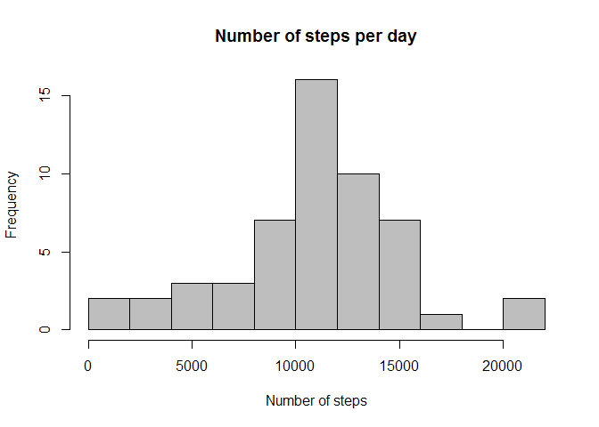
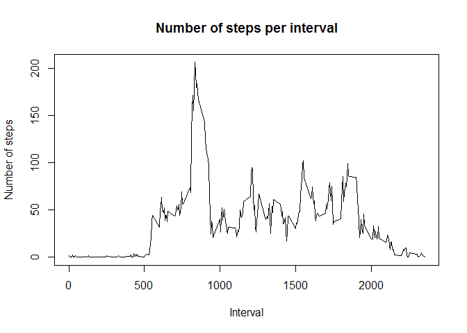
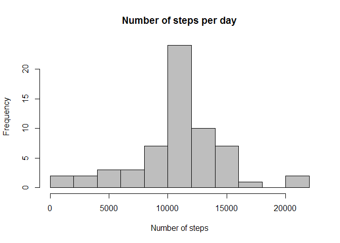
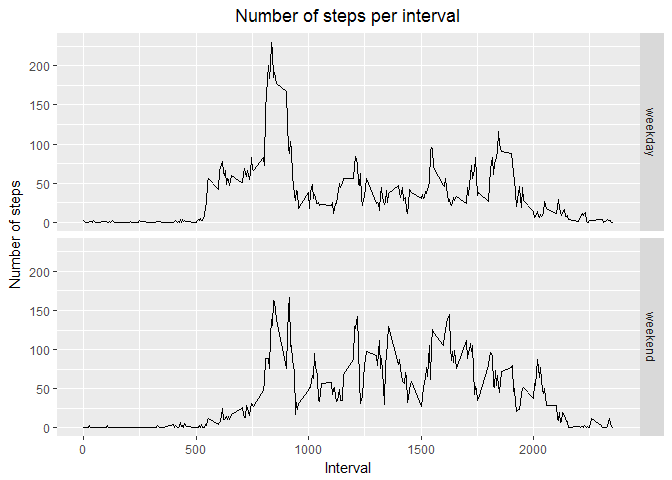

# Reproducible Research: Peer Assessment 1

## Loading and preprocessing the data


```r
if (!file.exists("activity.csv")) {
        
        unzip(zipfile = "activity.zip")
        
}

activity_data <- read.csv(file = "activity.csv", header = TRUE,
                          na.strings = "NA")

# Convert factors to dates
activity_data$date <- as.Date(activity_data$date)

stepsPerDay <- aggregate(steps ~ date, data = activity_data, FUN = sum)
```

## What is mean total number of steps taken per day?


```r
hist(stepsPerDay$steps, main = "Number of steps per day",
     xlab = "Number of steps", breaks = 10, col = "grey")
```

<!-- -->

```r
stepsMean <- mean(stepsPerDay$steps)
stepsMedian <- median(stepsPerDay$steps)
```

The **mean** of the number of steps per day is 1.0766189\times 10^{4}.  
The **median** of the number of steps per day is 10765.

## What is the average daily activity pattern?


```r
stepsPerInterval <- aggregate(steps ~ interval, data = activity_data, FUN = mean)

plot(x = stepsPerInterval$interval, y = stepsPerInterval$steps, type = "l",
     main = "Number of steps per interval", xlab = "Interval",
     ylab = "Number of steps")
```

<!-- -->

```r
maxSteps <- max(stepsPerInterval$steps)
intervalMaxSteps <- stepsPerInterval$interval[which.max(stepsPerInterval$steps)]
```

The maximum number of steps, on average across all the days per interval, is 206.1698113.  
The interval containing the maximum number of steps on average across all the days is 835.

## Imputing missing values


```r
numberOfMissingValues <- sum(!complete.cases(activity_data))
```

The total number of missing values in the dataset is 2304.

Missing values are filled using the mean of the corresponding 5-minute interval.


```r
activity_data_complete <- activity_data
stepsNa <- is.na(activity_data_complete$steps)
intervalMatch <- match(activity_data_complete[stepsNa,]$interval, stepsPerInterval$interval)
activity_data_complete[stepsNa, ]$steps <- stepsPerInterval[intervalMatch, ]$steps
```


```r
stepsPerDayComplete <- aggregate(steps ~ date, data = activity_data_complete, FUN = sum)

hist(stepsPerDayComplete$steps, main = "Number of steps per day",
     xlab = "Number of steps", breaks = 10, col = "grey")
```

<!-- -->

```r
stepsCompleteMean <- mean(stepsPerDayComplete$steps)
stepsCompleteMedian <- median(stepsPerDayComplete$steps)
```

The **mean** of the number of steps per day without missing values is 1.0766189\times 10^{4}.  
The **median** of the number of steps per day without missing values is 1.0766189\times 10^{4}.

The **mean** stayed the same as before imputing missing values.
The **median** however changed slightly and is now equal to the mean.

## Are there differences in activity patterns between weekdays and weekends?


```r
# Set locale for English Date names
Sys.setlocale("LC_TIME", "C")
```

```r
activity_data_complete$day <-
        ifelse(weekdays(activity_data_complete$date) %in% c("Saturday", "Sunday"),
               "weekend", "weekday")

activity_data_complete$day <- as.factor(activity_data_complete$day)

stepsPerIntervalComplete <- aggregate(steps ~ interval + day,
                                      data = activity_data_complete, FUN = mean)

library(ggplot2)

p <- ggplot(data = stepsPerIntervalComplete,
            aes(x = interval, y = steps)) +
    labs(x = "Interval", y = "Number of steps",
         title = "Number of steps per interval") +
    facet_grid(day ~ .) + theme(legend.position='none') +
    theme(plot.title = element_text(hjust = 0.5))

p + geom_line()
```

<!-- -->
